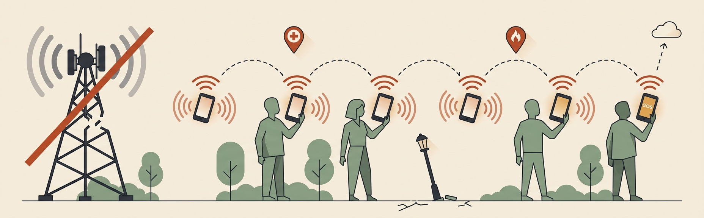
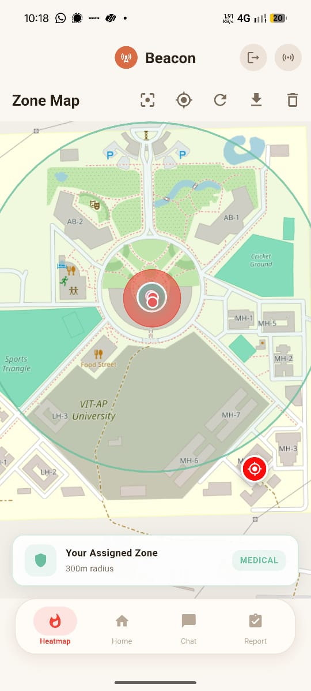
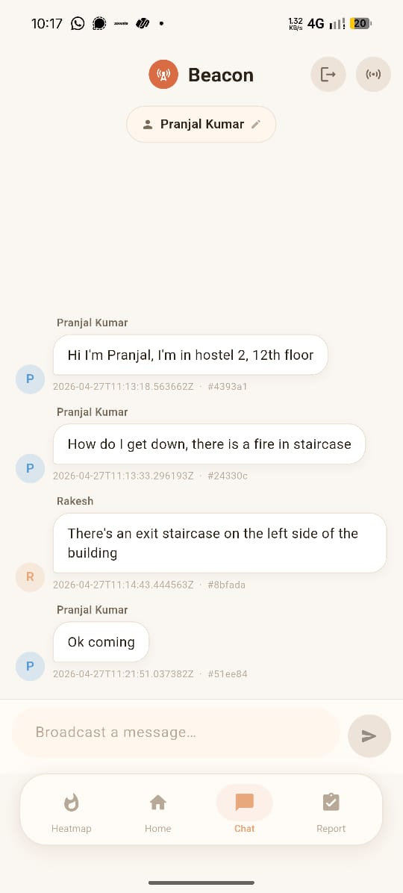
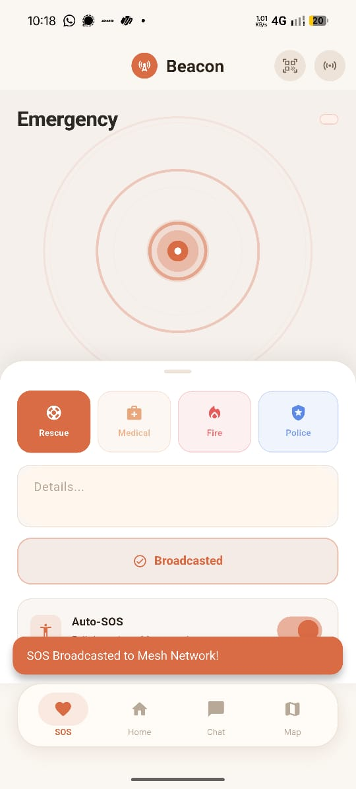
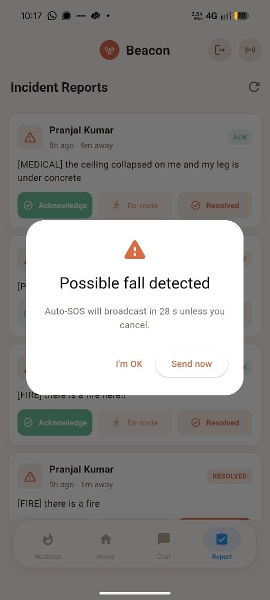
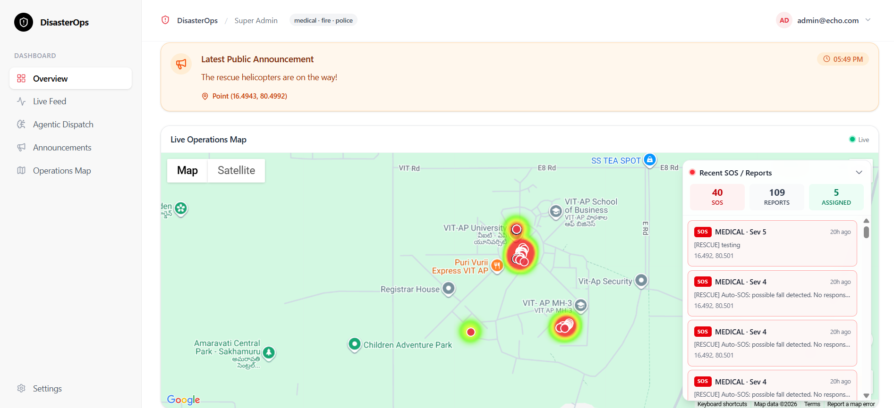
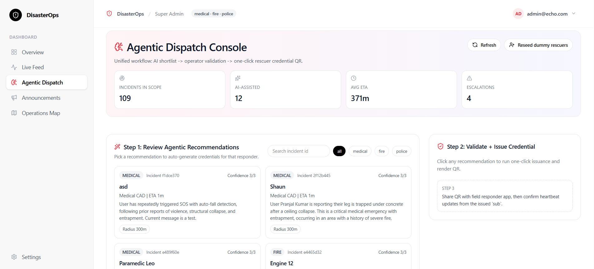
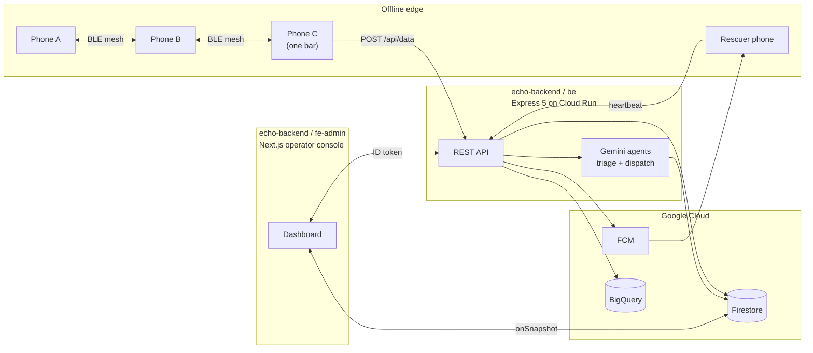

<div align="center">



# Echo

**Offline-first crisis communication over an ad-hoc Bluetooth Low Energy mesh.**

When the cell towers go down, Echo keeps people connected.

[](https://flutter.dev)
[](#)
[](https://developers.google.com/community/gdsc-solution-challenge)
[](LICENSE)
[](https://github.com/0xteamCookie/echo/actions/workflows/flutter-ci.yml)

Backend and operator console: **[github.com/0xteamCookie/echo-backend](https://github.com/0xteamCookie/echo-backend)**

</div>

---

## Contents

- [The Problem](#the-problem)
- [How Echo Works](#how-echo-works)
- [System Overview](#system-overview)
- [Demo](#demo)
- [Tech Stack](#tech-stack)
- [Architecture](#architecture)
- [AI Integration](#ai-integration)
- [Security](#security)
- [Getting Started](#getting-started)
- [Build and Release](#build-and-release)
- [Backend Setup (optional)](#backend-setup-optional)
- [Roadmap](#roadmap)
- [Contributing](#contributing)
- [License](#license)

---

## The Problem

In the first 72 hours of any major disaster — earthquakes, floods, wildfires, conflict — **the cellular and internet infrastructure that emergency services depend on is exactly what fails first**. Survivors trapped under rubble cannot dial 112. Rescuers fan out blindly. Operators stare at empty maps.

The 2023 Türkiye–Syria earthquake, the 2024 Wayanad landslides, the 2025 Los Angeles wildfires — every after-action report repeats the same line: *we lost comms in the first hour and never fully recovered them*.

Most "emergency apps" still assume a working internet connection. That assumption is the failure.

## How Echo Works

Echo turns every smartphone in the affected area into a router.

A device with no internet whispers an SOS over Bluetooth Low Energy. The phone in the next tent picks it up, signs the relay, and re-broadcasts. Hop by hop — up to 8 hops, signed end-to-end with Ed25519 — the message walks across the damaged neighbourhood until it reaches a phone that *does* still have one bar of signal. That phone uplinks the entire backlog to the Echo backend, where Gemini AI triages the message and the operator console dispatches the nearest qualified rescuer.

No new hardware. No new infrastructure. Just the phones already in everyone's pocket.

## System Overview

Echo is one product split across two repositories that work together.

| Component | Repo | Stack | Role |
|---|---|---|---|
| **Mobile app** | `echo` (this repo) | Flutter 3.41 / Dart 3.8, Android | The user-facing artifact. Runs the BLE mesh, on-device triage, fall detection, rescuer mode, offline maps. Standalone — works without the cloud. |
| **Backend API** | [`echo-backend`](https://github.com/0xteamCookie/echo-backend) (`be/`) | Express 5, TypeScript, Node 20 on Cloud Run | Stateless ingest, AI triage and dispatch, FCM, multilingual announcements. |
| **Operator console** | [`echo-backend`](https://github.com/0xteamCookie/echo-backend) (`fe-admin/`) | Next.js 16, React 19, Tailwind v4 | The 911-style dashboard where dispatchers watch incidents in real time, review AI triage, and assign rescuers. |

The split is deliberate: the mobile app must stand alone when the cloud is unreachable, and the backend must be deployable independently by any responder organisation. Either side can be forked, audited, or redeployed without touching the other.

### Key capabilities

| | |
|---|---|
| **BLE-mesh chat and SOS** | Store-and-forward routing, max 8 hops, 24 h TTL, RSSI-prioritised relay tick every 15 s. |
| **SOS fast-path** | Department-tagged emergencies (`MEDICAL` / `FIRE` / `POLICE` / `RESCUE`) blast to every connected peer immediately. |
| **Fall-detection auto-SOS** | Accelerometer state machine: 3 g impact, 2 min immobility, 30 s cancellable countdown. |
| **On-device triage** | Sub-500 ms keyword classifier produces structured `{categories, severity, summary}` JSON before transmission. |
| **Offline maps + heatmap** | OpenStreetMap tiles cached on-device; SOS density on a 50 m grid. |
| **Auto-sync on reconnect** | The moment a device gets one bar of signal it drains every unsynced row to the backend. |
| **Rescuer mode** | QR-code-provisioned RS256 JWT; 2-minute on-duty heartbeat feeds the AI dispatch agent. |
| **Multilingual announcements** | Operator broadcasts auto-translated into 10 languages. |
| **Ed25519 signed packets** | Every relay verifies the originator's signature; impersonation is cryptographically impossible. |

## Demo Video Link

<div align="center">
  <a href="https://youtu.be/YQhxX8otG1A">
    
  </a>
  <br/><br/>
  <a href="https://youtu.be/YQhxX8otG1A">
    
  </a>
</div>

### Mobile app — Beacon

<table>
<tr>
<td align="center"><br/><sub>Zone map</sub></td>
<td align="center"><br/><sub>Mesh chat</sub></td>
<td align="center"><br/><sub>SOS broadcast</sub></td>
<td align="center"><br/><sub>Incident reports · fall detection</sub></td>
</tr>
</table>

### Operator console — DisasterOps

<table>
<tr>
<td><br/><sub>Live operations map</sub></td>
</tr>
<tr>
<td><br/><sub>Agentic dispatch console</sub></td>
</tr>
</table>

---

## Tech Stack

### Mobile (this repo)

**Framework** — Flutter 3.41 · Dart 3.8 · Material 3 · single Android target.

| Layer | Packages |
|---|---|
| BLE | [`flutter_blue_plus`](https://pub.dev/packages/flutter_blue_plus) (central), [`ble_peripheral`](https://pub.dev/packages/ble_peripheral) (peripheral) |
| Sensors and location | [`geolocator`](https://pub.dev/packages/geolocator), [`sensors_plus`](https://pub.dev/packages/sensors_plus), [`flutter_map`](https://pub.dev/packages/flutter_map) + [`latlong2`](https://pub.dev/packages/latlong2), [`mobile_scanner`](https://pub.dev/packages/mobile_scanner) |
| Storage | [`sqflite`](https://pub.dev/packages/sqflite), [`flutter_secure_storage`](https://pub.dev/packages/flutter_secure_storage), [`shared_preferences`](https://pub.dev/packages/shared_preferences) |
| Crypto and auth | [`cryptography`](https://pub.dev/packages/cryptography) (Ed25519), [`dart_jsonwebtoken`](https://pub.dev/packages/dart_jsonwebtoken) (RS256) |
| Lifecycle | [`flutter_foreground_task`](https://pub.dev/packages/flutter_foreground_task), [`permission_handler`](https://pub.dev/packages/permission_handler), [`connectivity_plus`](https://pub.dev/packages/connectivity_plus) |

### Backend ([`echo-backend/be`](https://github.com/0xteamCookie/echo-backend/tree/main/be))

| | |
|---|---|
| Runtime | Node 20, Express 5.2, TypeScript 6 |
| Hosting | Google Cloud Run (stateless, autoscale to zero) |
| Identity and data | Firebase Admin SDK · Firestore · FCM |
| AI | `@google/generative-ai` — Gemini 2.5 Flash Lite (triage + dispatch) |
| Async | Google Cloud Pub/Sub (`beacon-ingest` topic) |
| Maps | `@googlemaps/google-maps-services-js` — Distance Matrix for ETAs |
| Translation | `@google-cloud/translate` v2 — operator announcements into 10 locales |
| Analytics | `@google-cloud/bigquery` streaming inserts |
| Hardening | `helmet`, `express-rate-limit`, strict CORS, App Check, JOSE-verified RS256 JWTs |

### Operator console ([`echo-backend/fe-admin`](https://github.com/0xteamCookie/echo-backend/tree/main/fe-admin))

| | |
|---|---|
| Framework | Next.js 16 (App Router), React 19, Tailwind v4 |
| Realtime | Firebase JS SDK 11 — Firestore `onSnapshot` (no API proxy layer) |
| Maps | `@vis.gl/react-google-maps` |
| Charts | `recharts` |
| Auth | Firebase Auth — Bearer ID token attached to every backend call |
| QR | `qrcode.react` for rescuer provisioning |

### Google services used

- **Gemini API** (Google AI Studio) — triage and dispatch agents
- **Firebase** — Auth, Firestore, FCM, App Check
- **Google Cloud** — Cloud Run, Pub/Sub, BigQuery, Cloud Translation
- **Google Maps Platform** — Maps JavaScript API, Distance Matrix API

## Architecture



### Mobile internals

The Flutter app is a **store-and-forward, signature-verified, RSSI-prioritised BLE mesh** with an opportunistic internet uplink.

| Folder | Responsibility |
|---|---|
| `core/` | Single source of truth: GATT UUIDs, `kRelayInterval = 15 s`, `kMaxHops = 8`, `kMessageLifespan = 1 d`. |
| `central/` · `peripheral/` | BLE radio roles. |
| `packet/` · `mesh/` | Wire format (v3 signed), relay tick, decision logic, collision avoidance. |
| `send/` · `receive/` | I/O paths for chat and SOS fast-path. |
| `crypto/` | Ed25519 keypair, signing, public-key export. |
| `auth/` | RS256 rescuer JWT verification. |
| `ai/` | On-device triage classifier. |
| `database/` | SQLite schema v4. |
| `online/` | Backend sync, heartbeat, announcements. |
| `services/` | Foreground service + fall detector. |
| `map/` · `screens/` · `widgets/` | UI and offline maps. |

### Wire format (v3)

`||`-delimited, base64-field, **Ed25519-signed** strings, fragmented to BLE MTU. The signed canonical form deliberately excludes `hopCount` so any honest relay can decrement TTL without invalidating the signature.

## AI Integration

Echo uses AI in two complementary places, deliberately split between offline and online.

**1. On-device triage** — a deterministic keyword classifier with a hard 500 ms timeout produces `{categories, severity, summary}` JSON that is base64-embedded in the packet. Even a message that never reaches the cloud is already triaged when an operator sees it. Source: [`lib/ai/on_device_triage.dart`](lib/ai/on_device_triage.dart). Documented swap-in path to Gemini Nano via `firebase_ai` once that SDK stabilises.

**2. Backend Gemini agents** — the moment a packet reaches the backend, two agents kick in:

- **Triage agent** — `gemini-2.5-flash-lite` with structured output: `{categories, severity 1–5, summary, victimInstructions[], dispatchMessage, reasoning}`. Threads up to 5 prior messages from the same device for context.
- **Dispatch agent** — Gemini plus Google Maps Distance Matrix ranks the top-5 on-duty rescuers per incident by ETA, current load, agency match, and severity.

Full prompts and schemas live in the [echo-backend repo](https://github.com/0xteamCookie/echo-backend).

## Security

| Concern | Mitigation |
|---|---|
| Identity | Each device generates a long-lived Ed25519 keypair on first launch and stores it in `flutter_secure_storage`. |
| Authenticity | Every v3 packet is signed; receivers verify before accepting. |
| Replay | `messageId` + `expiresAt` + per-peer `message_devices` join-table dedupe. |
| Rescuer auth | RS256 JWT signed by the backend's service account; public JWK at `/.well-known/jwks.json`. |
| Backend ingest | Bearer `BEACON_INGEST_TOKEN` + Firebase App Check on production. |
| Operator auth | Firebase ID token + custom claims (`role`, `agencies[]`) verified server-side. |
| Transport | Helmet (CSP, HSTS), strict CORS allowlist, 300 req/min global rate limit, 32 KB JSON body cap. |

See [SECURITY.md](SECURITY.md) for vulnerability reporting.

## Getting Started

### Prerequisites

- **Flutter** 3.41 or newer ([install guide](https://docs.flutter.dev/get-started/install))
- **Android Studio** with Android SDK API 31+
- A **physical Android device** (BLE peripheral mode is unreliable on emulators) — ideally **two**, to see the mesh in action

### 1. Clone and install

```bash
git clone https://github.com/0xteamCookie/echo.git
cd echo
flutter pub get
```

### 2. Configure (zero-config default)

```bash
cp dart-defines.example.json dart-defines.json
```

Defaults already point to the live demo backend at `https://echo-back.getmyroom.in`. Edit only if you are running your own backend.

### 3. Run

```bash
flutter run --dart-define-from-file=dart-defines.json
```

On first launch you will be asked to grant Bluetooth, Location (incl. background), Notifications, Microphone, and Battery-optimisation-exemption permissions. **All are required** for the mesh to function reliably in the background.

### 4. Test the mesh

With **two devices**, install the same APK on both, take them out of Wi-Fi range, and send a chat message from one. It should appear on the other within ~15 s. Toggle airplane mode on one to confirm offline operation.

## Build and Release

```bash
# Debug APK
flutter build apk --debug --dart-define-from-file=dart-defines.json

# Release APK (split per ABI for smaller downloads)
flutter build apk --release --split-per-abi --dart-define-from-file=dart-defines.json

# App Bundle for Play Store
flutter build appbundle --release --dart-define-from-file=dart-defines.json
```

Outputs land in `build/app/outputs/`.

### Required Android permissions

| Permission | Why |
|---|---|
| `BLUETOOTH_SCAN` / `_CONNECT` / `_ADVERTISE` | Mesh networking |
| `ACCESS_FINE_LOCATION` / `_BACKGROUND_LOCATION` | GPS on every packet; Android requires it for BLE scans |
| `FOREGROUND_SERVICE` | Keep the mesh alive when backgrounded |
| `POST_NOTIFICATIONS` | Foreground-service and SOS alerts |
| `WAKE_LOCK` | Reliable relay tick |
| `RECEIVE_BOOT_COMPLETED` | Restart mesh after reboot |
| `BODY_SENSORS` | Accelerometer fall detection |
| `RECORD_AUDIO` | Voice SOS |

## Backend Setup (optional)

The mobile app works out of the box against our deployed backend at `https://echo-back.getmyroom.in`. You only need this section if you want to run your own instance — for a regional deployment, an audit, or development.

Full setup, env-var reference, and Cloud Run deploy guide:

**→ [github.com/0xteamCookie/echo-backend](https://github.com/0xteamCookie/echo-backend)**

The short version:

```bash
git clone https://github.com/0xteamCookie/echo-backend.git
cd echo-backend

# Express API
cd be && cp .env.example .env   # fill in Firebase + Gemini + Maps keys
npm ci && npm run dev           # http://localhost:3000

# Operator console (in a second terminal)
cd ../fe-admin && cp .env.example .env.local
npm ci && PORT=3001 npm run dev # http://localhost:3001

# Point the Flutter app at your local backend
# In dart-defines.json, set BEACON_API_BASE_URL=http://10.0.2.2:3000
```

## Roadmap

The codebase is annotated with `P0`, `P1`, `P2`, `P3` tags pointing to the milestone tracker.

- **[shipped] P0** — core mesh, foreground service, dedupe, persistence
- **[shipped] P1** — SOS fast-path, RSSI-prioritised relay, rescuer mode
- **[shipped] P2** — Ed25519 signing, on-device triage, fall detection, voice-SOS scaffolding
- **[shipped] P3** — device pruning, backend hardening, App Check, BigQuery analytics
- **[planned]** — Gemini Nano on-device triage via `firebase_ai`
- **[planned]** — iOS support (BLE peripheral parity is the blocker)
- **[planned]** — LoRa fallback transport for sub-100 km links
- **[planned]** — Tor-style cover traffic for protest scenarios

## Contributing

See [CONTRIBUTING.md](CONTRIBUTING.md) and [CODE_OF_CONDUCT.md](CODE_OF_CONDUCT.md). For security issues please follow [SECURITY.md](SECURITY.md) instead of opening a public issue.

## License

Released under the [MIT License](LICENSE). Fork it, adapt it, deploy it in your region — that is the point.

---

<div align="center">

Built for **Google Solution Challenge 2026** — *Rapid Crisis Response* · Open Innovation track.

*"When the towers fall, the people are still there. So is the network."*

</div>
