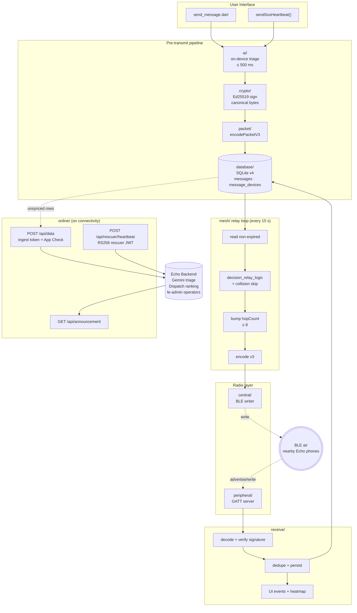

<div align="center">


# Echo

**Offline-first crisis communication over an ad-hoc Bluetooth Low Energy mesh.**

When the cell towers go down, Echo keeps people connected.

[](https://flutter.dev)
[](#)
[](https://developers.google.com/community/gdsc-solution-challenge)
[](#)
[](#)
[](LICENSE)

</div>

---

## Table of Contents

- [The Problem](#the-problem)
- [Our Solution](#our-solution)
- [Key Features](#key-features)
- [Tech Stack](#tech-stack)
- [Architecture](#architecture)
- [Wire Format and Security](#wire-format-and-security)
- [AI Integration](#ai-integration)
- [Backend Integration](#backend-integration)
- [Project Structure](#project-structure)
- [Getting Started](#getting-started)
- [Build and Release](#build-and-release)
- [Permissions](#permissions)
- [Roadmap](#roadmap)
- [Contributing](#contributing)
- [License](#license)
- [Team](#team)

---

## The Problem

In the first 72 hours of any major disaster — earthquakes, floods, wildfires, conflict, mass-casualty events — **the cellular and internet infrastructure that emergency services depend on is exactly what fails first**. Survivors trapped under rubble cannot dial 112. Rescue workers fan out blindly. Operators in command centers stare at empty maps.

The 2023 Türkiye–Syria earthquake, the 2024 Wayanad landslides, the 2025 Los Angeles wildfires — every after-action report says the same thing: *we lost comms in the first hour and never fully recovered them*.

**Most "emergency apps" still assume a working internet connection.** That assumption is the failure.

> **Submitted under:** Google Solution Challenge 2026 — *Rapid Crisis Response* theme — *Open Innovation* track.

## Our Solution

Echo turns every smartphone in the affected area into a router.

A device with no internet whispers an SOS over Bluetooth Low Energy. The phone in the next tent picks it up, hashes it, signs the relay, and re-broadcasts. Hop by hop — up to 8 hops, signed end-to-end with Ed25519 — the message walks across a damaged neighbourhood until it reaches a phone that *does* still have one bar of signal. That phone uplinks the entire backlog to the [Echo backend](../echo-backend), where on-arrival Gemini AI triages the message and the operator console dispatches the nearest qualified rescuer.

No new hardware. No new infrastructure. Just the phones already in everyone's pocket.

## Key Features

| Capability | What it does |
|---|---|
| **BLE-mesh chat and SOS** | Store-and-forward routing, max 8 hops, 24-hour TTL, RSSI-prioritized relay tick every 15 s. |
| **SOS fast-path** | Department-tagged emergencies (`MEDICAL` / `FIRE` / `POLICE` / `RESCUE`) blast to *every* connected peer immediately, bypassing the relay queue. |
| **Fall-detection auto-SOS** | Accelerometer state machine: 3 g impact, 2 min immobility, 30 s cancellable countdown, auto-broadcast with last-known GPS. |
| **On-device triage** | A sub-500 ms keyword classifier produces structured `{categories, severity, summary}` JSON before transmission so even fully-offline messages arrive pre-triaged. |
| **Offline maps and heatmap** | OpenStreetMap tiles cached on-device; SOS density visualized on a 50 m grid. |
| **Auto-sync on reconnect** | `connectivity_plus` listener drains every unsynced row to the backend the second a single bar returns. |
| **Rescuer mode** | QR-code-provisioned RS256 JWT; 2-minute on-duty heartbeat (location and battery) feeds the backend's AI dispatch agent. |
| **Authority announcements** | Pull-based feed of multilingual operator broadcasts. |
| **Ed25519-signed packets** | Every relay verifies the originator's signature; impersonation is cryptographically impossible. |
| **Background-resilient** | Android foreground service keeps the mesh alive when the screen is off. |

## Tech Stack

**Framework** — Flutter 3.8 / Dart `^3.8.1`, Material 3.

**Bluetooth and networking**

| Package | Role |
|---|---|
| [`flutter_blue_plus`](https://pub.dev/packages/flutter_blue_plus) `^2.2.1` | BLE central — scan, connect, GATT write |
| [`ble_peripheral`](https://pub.dev/packages/ble_peripheral) `^2.4.0` | BLE peripheral — advertise, GATT server |
| [`connectivity_plus`](https://pub.dev/packages/connectivity_plus) `^6.0.0` | Connectivity-driven backend sync |
| [`http`](https://pub.dev/packages/http) `^1.2.0` | Backend ingest, heartbeat, announcements |

**Location and sensors**

| Package | Role |
|---|---|
| [`geolocator`](https://pub.dev/packages/geolocator) `^14.0.2` | GPS fixes attached to every packet |
| [`flutter_map`](https://pub.dev/packages/flutter_map) `^6.1.0` + [`latlong2`](https://pub.dev/packages/latlong2) | Offline-capable OSM map |
| [`sensors_plus`](https://pub.dev/packages/sensors_plus) `^6.0.0` | Accelerometer-driven fall detection |
| [`mobile_scanner`](https://pub.dev/packages/mobile_scanner) `7.2.0` | QR scanner for rescuer onboarding |

**Persistence and security**

| Package | Role |
|---|---|
| [`sqflite`](https://pub.dev/packages/sqflite) `^2.3.0` | Local store-and-forward queue |
| [`flutter_secure_storage`](https://pub.dev/packages/flutter_secure_storage) `^10.0.0` | Rescuer JWT vault |
| [`shared_preferences`](https://pub.dev/packages/shared_preferences) `^2.5.5` | Device ID, role, onboarding flag |
| [`cryptography`](https://pub.dev/packages/cryptography) `^2.7.0` | Ed25519 device identity |
| [`dart_jsonwebtoken`](https://pub.dev/packages/dart_jsonwebtoken) `^3.4.0` | RS256 rescuer JWT verification |

**Lifecycle**

| Package | Role |
|---|---|
| [`flutter_foreground_task`](https://pub.dev/packages/flutter_foreground_task) `^8.17.0` | Keeps the mesh alive when the app is backgrounded |
| [`permission_handler`](https://pub.dev/packages/permission_handler) `^11.0.0` | Runtime BT, location, mic, sensor permissions |

## Architecture

Echo is a **store-and-forward, signature-verified, RSSI-prioritized BLE mesh** with an opportunistic internet uplink.



### Folder map (`lib/`)

| Folder | Responsibility |
|---|---|
| `main.dart` | App bootstrap: DB, BLE central + peripheral, relay loop, Ed25519 keypair, foreground service, fall-detector hooks, connectivity sync. |
| `core/` | Single source of truth: GATT UUIDs, `kRelayInterval = 15 s`, `kMaxHops = 8`, `kMessageLifespan = 1 d`, fall thresholds, OSM tile URL, heatmap grid size. |
| `peripheral/` | Advertises GATT service, accepts writes from peers. |
| `central/` | Scans, maintains a `_seenDevices` map with 5-min TTL, performs GATT writes. |
| `packet/` | Builds the packet dict (deviceId, messageId, gps, time, expiresAt, hopCount, isSos, senderName). |
| `mesh/` | Wire format (v3 signed, v2 legacy, v1 read-only), relay tick, decision logic, collision avoidance. |
| `send/` | `sendNewMessage()` chat path and `sendSosHeartbeat()` department-prefixed SOS fast-path. |
| `receive/` | Decode, verify, dedupe, persist, emit UI events. |
| `online/` | `sync.dart` (uplink), `rescuer_sync.dart` (heartbeat), `announcements.dart` (operator broadcasts). |
| `services/` | `ActivityMonitor` (fall detection), `MeshForegroundService` (Android foreground host). |
| `crypto/` | Ed25519 keypair, signing, public-key export. |
| `auth/` | RS256 rescuer JWT verification. |
| `ai/` | On-device triage classifier. |
| `database/` | SQLite schema v4 + migrations. |
| `map/` | OSM offline tile manager + heatmap aggregation. |
| `screens/`, `widgets/`, `layout/` | UI: `home_screen`, `chat_screen`, `sos_screen`, `map_screen`, `heatmap_screen`, `devices_screen`, `scanner_screen`, `report_screen`, `ack_db_screen`, `onboarding_screen`. |
| `models/` | Plain Dart data classes. |

## Wire Format and Security

Echo packets are **`||`-delimited, base64-field, Ed25519-signed** strings, fragmented to fit BLE MTU. The signed canonical form deliberately **excludes `hopCount`** so any honest relay can decrement TTL without invalidating the signature.

| Version | Status | Notes |
|---|---|---|
| **v3** | current | Ed25519-signed, includes `triage` and `senderPublicKey` fields. |
| v2 | legacy | Unsigned, accepted on receive only. |
| v1 | read-only | Old format, decode-only for backward compatibility. |

Security posture:

- **Identity** — Each device generates a long-lived Ed25519 keypair on first launch and stores it in `flutter_secure_storage`.
- **Authenticity** — Every v3 packet is signed; receivers verify before accepting.
- **Replay protection** — `messageId` plus `expiresAt` plus per-peer `message_devices` join-table dedupe.
- **Rescuer authentication** — RS256 JWT signed by the backend's service account; public JWK exposed at `/.well-known/jwks.json`. Hard-coded admin pubkey in `auth/auth_service.dart` for offline verification.
- **Backend ingest** — Bearer `BEACON_INGEST_TOKEN` plus Firebase App Check on production.

See [SECURITY.md](SECURITY.md) for our vulnerability-reporting policy.

## AI Integration

Echo uses AI in **two complementary places**, deliberately split between offline and online:

### 1. On-device triage (offline-first)

[`lib/ai/on_device_triage.dart`](lib/ai/on_device_triage.dart) runs a deterministic keyword classifier with a hard 500 ms timeout. It produces:

```json
{
  "source": "on-device-keyword",
  "categories": ["medical", "trapped"],
  "severity": "critical",
  "summary": "Adult male, leg fracture, building collapse"
}
```

The result is base64-embedded in the packet's `triage` field, so even a message that *never* reaches the cloud is already triaged when an operator sees it on the mesh visualizer.

> The `source` field is intentionally `on-device-keyword` with a documented swap-in path to `FirebaseAI.onDeviceModel()` (Gemini Nano via Android AICore) once the `firebase_ai` Flutter SDK stabilises. The keyword classifier is then kept as a guaranteed fallback.

### 2. Backend Gemini agents (when online)

The moment a packet reaches `echo-backend/be`, two Gemini agents kick in:

- **Triage agent** — `gemini-2.5-flash-lite` with structured output: `{categories, severity 1-5, summary, victimInstructions[], dispatchMessage, reasoning}`. Threads up to 5 prior messages from the same device for context.
- **Dispatch agent** — Gemini plus Google Maps Distance Matrix API ranks the top-5 on-duty rescuers per incident by ETA, current load, agency match, and severity.

See [`echo-backend/`](../echo-backend) for the full agent prompts and schemas.

## Backend Integration

Production endpoint: `https://echo-back.getmyroom.in`

| Endpoint | Method | Auth | Used by |
|---|---|---|---|
| `/api/data` | `POST` | `BEACON_INGEST_TOKEN` + App Check | Every online relayer |
| `/api/rescuer/heartbeat` | `POST` | RS256 rescuer JWT | Rescuer mode (every 2 min) |
| `/api/announcement` | `GET` | none (public) | Home screen feed (every 2 min) |
| `/api/push/register` | `POST` | RS256 rescuer JWT | FCM token registration |

Both `BEACON_API_BASE_URL` and `BEACON_INGEST_TOKEN` are read via `String.fromEnvironment(...)` with sane defaults — the app builds and runs against the live backend with **zero configuration**.

## Project Structure

```
echo/
├── android/                      # Android-specific config (foreground service, perms)
├── assets/                       # Logo, splash, OSM offline tiles
├── lib/
│   ├── main.dart                 # Entry point, AppState singleton
│   ├── core/constants.dart       # Single source of truth
│   ├── ai/on_device_triage.dart
│   ├── auth/auth_service.dart
│   ├── central/                  # BLE central role
│   ├── peripheral/               # BLE peripheral role
│   ├── crypto/ed25519.dart
│   ├── database/                 # SQLite + migrations
│   ├── mesh/                     # Wire format, relay loop, decisions
│   ├── packet/                   # Packet builder
│   ├── send/  receive/           # I/O paths
│   ├── online/                   # Backend sync
│   ├── services/                 # Foreground service, fall detector
│   ├── map/                      # Offline tiles + heatmap
│   ├── screens/  widgets/  layout/
│   └── models/
├── dart-defines.example.json
└── pubspec.yaml
```

## Getting Started

### Prerequisites

- **Flutter** 3.8 or newer (Dart `^3.8.1`) — [install guide](https://docs.flutter.dev/get-started/install)
- **Android Studio** with an Android SDK at API 31 or above
- A **physical Android device** (BLE peripheral mode is unreliable on emulators) — ideally **two**, to see the mesh in action

### Installation

```bash
git clone <this-repo>
cd echo
flutter pub get
cp dart-defines.example.json dart-defines.json
```

The defaults in `dart-defines.json` already point to the live demo backend. Edit only if you are running your own [`echo-backend`](../echo-backend) instance.

### Run

```bash
flutter run --dart-define-from-file=dart-defines.json
```

On first launch you will be asked to grant Bluetooth, Location (incl. background), Notifications, Microphone, and Battery-optimization-exemption permissions. **All are required** for the mesh to function reliably in the background.

## Build and Release

```bash
# Debug APK
flutter build apk --debug --dart-define-from-file=dart-defines.json

# Release APK (split per ABI for smaller downloads)
flutter build apk --release --split-per-abi --dart-define-from-file=dart-defines.json

# App Bundle (for Play Store)
flutter build appbundle --release --dart-define-from-file=dart-defines.json
```

Outputs land in `build/app/outputs/`.

## Permissions

| Permission | Why |
|---|---|
| `BLUETOOTH_SCAN` / `_CONNECT` / `_ADVERTISE` | Mesh networking |
| `ACCESS_FINE_LOCATION` / `_BACKGROUND_LOCATION` | GPS attached to every packet; required by Android for BLE scanning |
| `FOREGROUND_SERVICE` (`connectedDevice`, `location`) | Keep the mesh alive when backgrounded |
| `POST_NOTIFICATIONS` | Foreground-service notification and incoming SOS alerts |
| `WAKE_LOCK` | Reliable relay tick |
| `RECEIVE_BOOT_COMPLETED` | Auto-restart mesh after reboot |
| `RECORD_AUDIO` | Voice SOS (P2-14) |
| `BODY_SENSORS` | Accelerometer fall detection |

## Roadmap

The codebase is annotated with `P0-…` / `P1-…` / `P2-…` / `P3-…` tags pointing to the milestone tracker. Highlights:

- **[shipped] P0** — core mesh, foreground service, dedupe, persistence
- **[shipped] P1** — SOS fast-path, RSSI-prioritized relay, rescuer mode
- **[shipped] P2** — Ed25519 signing, on-device triage, fall detection, voice-SOS scaffolding
- **[shipped] P3** — device pruning, backend hardening, App Check, BigQuery analytics
- **[planned]** — Gemini Nano on-device triage via `firebase_ai` (when stable)
- **[planned]** — iOS support (BLE peripheral parity is the blocker)
- **[planned]** — Tor-style cover traffic for protest scenarios
- **[planned]** — LoRa fallback transport

## Contributing

We welcome contributions. See [CONTRIBUTING.md](CONTRIBUTING.md) and our [CODE_OF_CONDUCT.md](CODE_OF_CONDUCT.md). Found a security issue? Please follow [SECURITY.md](SECURITY.md) instead of opening a public issue.

## License

Echo is released under the [MIT License](LICENSE). You are explicitly encouraged to fork, adapt, and deploy it in your region — that is the point.

## Team

Built for **Google Solution Challenge 2026** under the *Rapid Crisis Response* theme (Open Innovation track).

> *"When the towers fall, the people are still there. So is the network."*
